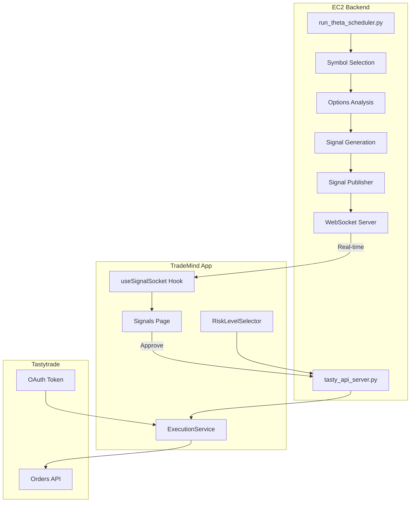
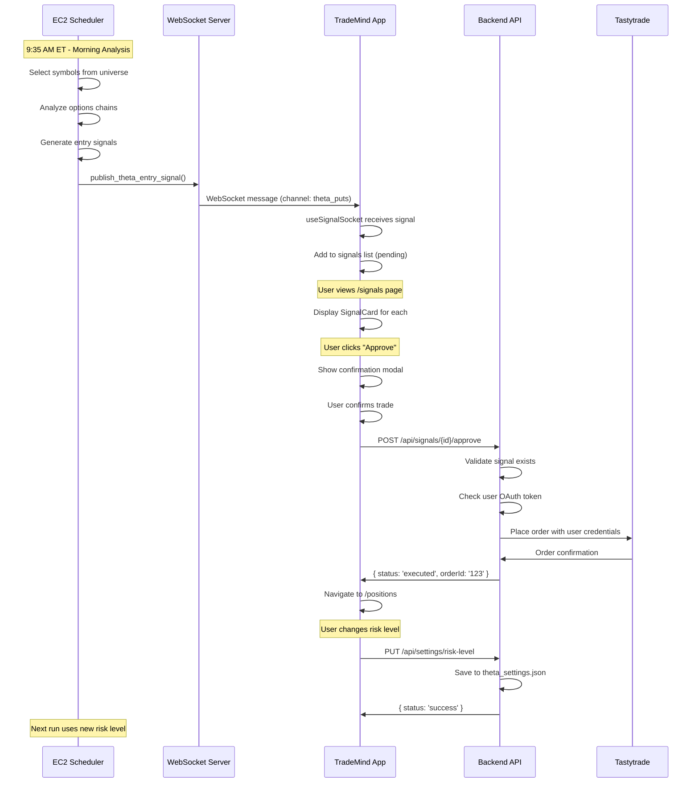

# 🔄 End-to-End Production Flow

## Architecture Overview



---

## Step 1: Signal Generation (EC2 Backend)

### Scheduler Execution

**File:** [run_theta_scheduler.py](file:///d:/Projects/tastywork-trading-1/run_theta_scheduler.py)  
**Schedule:** Mon-Fri @ 9:35 AM ET

```python
# Morning analysis workflow
def run_morning_analysis():
    # 1. Connect to IB Gateway (market data)
    ib = IBDataProvider()
    ib.connect()
    
    # 2. Select symbols (top 5 from universe)
    selector = SymbolSelector(min_iv_percentile=20, select_top_n=5)
    symbols = selector.select_daily_watchlist(candidates=config.THETA_UNIVERSE)
    
    # 3. Analyze options chains
    analyzer = OptionsAnalyzer(target_delta=0.30, dte_min=7, dte_max=45)
    all_puts = []
    for symbol in symbols[:5]:
        puts = ib.get_put_chain_for_theta(symbol, target_date, 0.20, 0.40)
        all_puts.extend(analyzer.analyze_symbol(symbol, 80, puts))
    
    # 4. Generate entry signals (uses RISK LEVEL)
    signal_gen = ThetaSignalGenerator.from_risk_profile(config.THETA_RISK_LEVEL)
    entry_signals = signal_gen.generate_entry_signals(ranked_puts=all_puts, ...)
    
    # 5. Publish to WebSocket
    for signal in entry_signals:
        publish_theta_entry_signal(signal)  # ← Broadcasts to clients
```

### Signal Publishing

**File:** [signal_publisher/theta.py](file:///d:/Projects/tastywork-trading-1/signal_publisher/theta.py)

```python
@dataclass
class ThetaEntrySignal:
    id: str
    symbol: str
    strike: float
    expiration: str
    entry_price: float
    delta: float
    theta: float
    confidence: float
    contracts: int
    # ... more fields ...

def publish_theta_entry_signal(signal: ThetaEntrySignal) -> bool:
    data = signal.to_dict()
    data['strategy'] = 'theta'
    data['signal_type'] = 'entry'
    
    # Broadcast to WebSocket channels
    broadcast_to_channel('theta_puts', data)
    broadcast_to_channel('theta_entry', data)
```

**Channels:**
- `theta_puts` - All theta signals
- `theta_entry` - Entry signals only
- `theta_exit` - Exit signals only

---

## Step 2: Client-Side Signal Reception

### WebSocket Hook

**File:** [src/hooks/useSignalSocket.ts](file:///d:/Projects/trademind-app/src/hooks/useSignalSocket.ts)

```typescript
export function useSignalSocket({
    url = 'wss://ws.trademind.bot',  // Production WebSocket
    channels = ['calendar_spread', 'theta_puts'],  // Subscribe to theta
    onSignal,
    onConnect,
    onDisconnect,
}: UseSignalSocketOptions = {}) {
    
    // Connect and subscribe
    ws.onopen = () => {
        ws.send(JSON.stringify({
            type: 'subscribe',
            channels,  // ['theta_puts']
        }));
    };
    
    // Handle incoming signals
    ws.onmessage = (event) => {
        const message = JSON.parse(event.data);
        
        if (message.type === 'signal') {
            const signal = message.data;
            onSignal?.(signal, message.channel);
        }
    };
    
    return { isConnected, lastSignal, subscribe, unsubscribe };
}
```

### Signal Types

**File:** [src/types/signals.ts](file:///d:/Projects/trademind-app/src/types/signals.ts)

```typescript
// Theta-specific signal (cash-secured puts)
export interface ThetaSignal extends BaseSignal {
    strategy: 'theta';
    strike: number;
    expiration: string;
    dte: number;
    
    entry_price: number;
    delta: number;
    theta: number;
    vega: number;
    iv: number;
    
    contracts: number;
    probability_otm: number;
}
```

---

## Step 3: Signal Display & Approval UI

### Signals Page

**File:** [src/app/signals/page.tsx](file:///d:/Projects/trademind-app/src/app/signals/page.tsx)

```tsx
export default function SignalsPage() {
    const { allSignals, isConnected, removeSignal } = useSignalContext();
    const [approving, setApproving] = useState<string | null>(null);
    const [confirmModal, setConfirmModal] = useState<Signal | null>(null);
    
    // Filter pending signals only
    const signals = allSignals.filter(s => s.status === 'pending');
    
    // Approve flow
    const handleConfirmApprove = async () => {
        setApproving(confirmModal.id);
        
        // Send to backend for execution
        const response = await fetch(`/api/signals/${confirmModal.id}/approve`, {
            method: 'POST',
            body: JSON.stringify({ execute: true }),
        });
        
        if (response.ok) {
            removeSignal(confirmModal.id);
            router.push('/positions');  // Navigate to see trade
        }
    };
    
    return (
        <main>
            {signals.map(signal => (
                <SignalCard 
                    key={signal.id}
                    signal={signal}
                    onApprove={() => handleApproveClick(signal)}
                    onSkip={() => handleSkip(signal.id)}
                />
            ))}
            
            {/* Confirmation Modal */}
            {confirmModal && (
                <ConfirmTradeModal 
                    signal={confirmModal}
                    onConfirm={handleConfirmApprove}
                    onCancel={() => setConfirmModal(null)}
                />
            )}
        </main>
    );
}
```

### Signal Card Component

```tsx
function SignalCard({ signal, onApprove, onSkip, isApproving }) {
    return (
        <div className="glass-card p-5">
            {/* Header with symbol and risk level badge */}
            <div className="flex items-center justify-between">
                <h3 className="font-bold">{signal.symbol}</h3>
                <span className={riskColors[signal.riskLevel]}>
                    {signal.riskLevel}
                </span>
            </div>
            
            {/* Strike & Expiries */}
            <div className="grid grid-cols-3 gap-3">
                <div>Strike: ${signal.strike}</div>
                <div>Expiry: {signal.expiration}</div>
                <div>DTE: {signal.dte}</div>
            </div>
            
            {/* Action Buttons */}
            <div className="flex gap-3">
                <button onClick={onSkip}>Skip</button>
                <button onClick={onApprove}>
                    {isApproving ? 'Executing...' : 'Approve'}
                </button>
            </div>
        </div>
    );
}
```

---

## Step 4: Trade Execution to Tastytrade

### Execution Service

**File:** [src/services/execution.ts](file:///d:/Projects/trademind-app/src/services/execution.ts)

```typescript
export class ExecutionService {
    // Execute any signal type
    static async executeSignal(signal: Signal): Promise<ExecutionResult> {
        if (isThetaSignal(signal)) {
            return await this.executeThetaSignal(signal);
        } else if (isCalendarSignal(signal)) {
            return await this.executeCalendarSignal(signal);
        }
    }
    
    // Execute theta signal (cash-secured put)
    private static async executeThetaSignal(signal: ThetaSignal): Promise<ExecutionResult> {
        const response = await fetch('/api/tastytrade/orders', {
            method: 'POST',
            body: JSON.stringify({
                strategy: 'theta',
                symbol: signal.symbol,
                order_type: 'Limit',
                price: signal.entry_price,
                legs: [{
                    instrument_type: 'Equity Option',
                    symbol: this.buildOptionSymbol(
                        signal.symbol,
                        signal.expiration,
                        'P',  // PUT
                        signal.strike
                    ),
                    action: 'SELL_TO_OPEN',
                    quantity: signal.contracts
                }]
            })
        });
        
        return { success: true, orderId: data.orderId };
    }
}
```

### Backend Approval Handler

**File:** [tasty_api_server.py](file:///d:/Projects/tastywork-trading-1/tasty_api_server.py) (lines 600-717)

```python
def handle_approve_signal(self, signal_id: str, data: dict):
    """Approve signal and execute using USER's OAuth credentials."""
    
    # Extract user credentials
    user_refresh_token = data.get('refreshToken')
    account_number = data.get('accountNumber')
    execute = data.get('execute', True)
    
    # Find signal in database
    signal = signal_repo.get_signal(signal_id)
    
    if execute:
        # Execute using USER's session (not master account!)
        result = self._execute_calendar_spread_for_user(
            signal_data, 
            user_refresh_token, 
            account_number
        )
        
        # Update execution status
        user_repo.create_or_update_execution(
            user_id=user_id,
            signal_id=signal_id,
            status='executed',
            order_id=result.get('orderId')
        )
```

### Tastytrade Order Execution

```python
def _execute_calendar_spread_for_user(self, signal, user_refresh_token, account_number):
    """Execute trade using USER's OAuth credentials."""
    
    # Create per-user session
    session = create_user_session(user_refresh_token)
    account = get_user_account(session, account_number)
    
    # Build order legs
    legs = [
        OrderLeg(
            instrument_type='Equity Option',
            symbol=option_symbol,
            quantity=1,
            action=OrderAction.SELL_TO_OPEN  # For theta puts
        ),
    ]
    
    # Create and place order
    order = NewOrder(
        time_in_force=OrderTimeInForce.DAY,
        order_type=OrderType.LIMIT,
        legs=legs,
        price=signal['cost']
    )
    
    response = account.place_order(session, order, dry_run=False)
    return {'orderId': str(response.order.id)}
```

---

## Step 5: Risk Level Configuration

### RiskLevelSelector Component

**File:** [src/components/signals/RiskLevelSelector.tsx](file:///d:/Projects/trademind-app/src/components/signals/RiskLevelSelector.tsx)

```tsx
export function RiskLevelSelector({ apiBase, onLevelChange }) {
    const [currentLevel, setCurrentLevel] = useState<string>('MEDIUM');
    const [profiles, setProfiles] = useState<RiskProfile[]>([]);
    
    // Fetch available profiles from backend
    async function fetchRiskProfiles() {
        const res = await fetch(`${apiBase}/api/settings/risk-profiles`);
        const data = await res.json();
        setProfiles(data.profiles);
    }
    
    // Get current level
    async function fetchCurrentLevel() {
        const res = await fetch(`${apiBase}/api/settings/risk-level`);
        const data = await res.json();
        setCurrentLevel(data.current_level);
    }
    
    // Change level
    async function handleSelectLevel(level: string) {
        const res = await fetch(`${apiBase}/api/settings/risk-level`, {
            method: 'PUT',
            body: JSON.stringify({ level })
        });
        
        if (data.status === 'success') {
            setCurrentLevel(level);
            onLevelChange?.(level);
        }
    }
    
    return (
        <div>
            <h2>Risk Level</h2>
            <span>Current: {currentLevel}</span>
            
            <div className="grid grid-cols-3 gap-4">
                {profiles.map((profile) => (
                    <div 
                        key={profile.level}
                        onClick={() => handleSelectLevel(profile.level)}
                        className={currentLevel === profile.level ? 'selected' : ''}
                    >
                        <span>{profile.icon}</span>
                        <h3>{profile.name}</h3>
                        <p>{profile.description}</p>
                        
                        <div>Max Positions: {profile.highlights.max_positions}</div>
                        <div>Capital: {profile.highlights.capital_deployed}</div>
                        <div>Expected ROI: {profile.highlights.expected_roi}</div>
                        <div>Max Loss: {profile.highlights.max_loss}</div>
                    </div>
                ))}
            </div>
        </div>
    );
}
```

### Backend Risk Level API

**File:** [tasty_api_server.py](file:///d:/Projects/tastywork-trading-1/tasty_api_server.py) (lines 346-476)

```python
# GET /api/settings/risk-level
def handle_get_risk_level(self):
    """Get current risk level and profile details."""
    from src.theta_spreads.risk_profiles import (
        LOW_RISK_PROFILE, MEDIUM_RISK_PROFILE, HIGH_RISK_PROFILE
    )
    
    # Load from settings file
    settings_file = Path("data/theta_settings.json")
    current_level = "MEDIUM"
    if settings_file.exists():
        settings = json.load(open(settings_file))
        current_level = settings.get("risk_level", "MEDIUM")
    
    self._send_json({
        "current_level": current_level,
        "profiles": {
            "LOW": profile_to_dict(LOW_RISK_PROFILE),
            "MEDIUM": profile_to_dict(MEDIUM_RISK_PROFILE),
            "HIGH": profile_to_dict(HIGH_RISK_PROFILE),
        }
    })

# GET /api/settings/risk-profiles
def handle_get_risk_profiles(self):
    """Get all risk profiles for display."""
    return [
        {"level": "LOW", "name": "Conservative", "icon": "🛡️", ...},
        {"level": "MEDIUM", "name": "Moderate", "icon": "⚖️", ...},
        {"level": "HIGH", "name": "Aggressive", "icon": "🚀", ...},
    ]

# PUT /api/settings/risk-level
def handle_set_risk_level(self, data):
    """Set the Theta strategy risk level."""
    level = data.get("level").upper()
    
    if level not in ["LOW", "MEDIUM", "HIGH"]:
        return error("Invalid risk level")
    
    # Save to settings file
    settings_file.write({"risk_level": level})
    
    # Update environment for current session
    os.environ["THETA_RISK_LEVEL"] = level
    
    return {"status": "success", "current_level": level}
```

---

## Complete Data Flow



---

## Key Files Summary

| Component | File | Purpose |
|-----------|------|---------|
| **Scheduler** | `run_theta_scheduler.py` | Generates signals @ 9:35 AM |
| **Signal Publisher** | `signal_publisher/theta.py` | Broadcasts to WebSocket |
| **Backend API** | `tasty_api_server.py` | Handles approvals, risk settings |
| **Risk Profiles** | `src/theta_spreads/risk_profiles.py` | LOW/MEDIUM/HIGH definitions |
| **WebSocket Hook** | `src/hooks/useSignalSocket.ts` | Client-side signal reception |
| **Signal Types** | `src/types/signals.ts` | TypeScript interfaces |
| **Signals Page** | `src/app/signals/page.tsx` | Signal display & approval UI |
| **Risk Selector** | `src/components/signals/RiskLevelSelector.tsx` | Risk level settings UI |
| **Execution** | `src/services/execution.ts` | Trade execution service |

---

## Key Insights

### 1. Multi-User Design
- Each user executes with their OWN OAuth token
- Signal stays `pending` globally (others can also trade)
- User executions tracked separately

### 2. Risk Level Integration
- Set via UI → API → `theta_settings.json`
- Scheduler reads on next run
- Controls position sizing, max positions, VIX thresholds

### 3. Real-Time Signal Flow
- WebSocket pushes signals instantly
- No polling required
- Reconnects with exponential backoff

### 4. OAuth Per-User Execution
- Each trade uses user's refresh token
- Creates fresh session per execution
- Trade appears in user's brokerage account

---

## Current Status

✅ **Signal Generation**: Working on EC2  
✅ **WebSocket Publishing**: Configured  
✅ **Client Reception**: useSignalSocket hook  
✅ **Signal Display**: Signals page  
✅ **Approval Flow**: Confirmation modal  
✅ **Trade Execution**: Tastytrade SDK  
✅ **Risk Level UI**: RiskLevelSelector component  
✅ **Risk Level API**: GET/PUT endpoints  

---

## Missing/Incomplete

Based on code review, the following may need attention:

### 1. Theta Signal UI (Not Displayed)
The current signals page seems optimized for **calendar spreads**, not theta puts. The signal card shows:
- `frontExpiry` / `backExpiry` (calendar spread fields)
- Missing theta-specific fields like `delta`, `probability_otm`

**Recommendation:** Create `ThetaSignalCard` component with appropriate fields.

### 2. Risk Level Selector Not Integrated
The `RiskLevelSelector` component exists but may not be visible in the main UI.

**Recommendation:** Add to settings page or dashboard.

### 3. WebSocket Channel for Theta
Currently subscribes to `['calendar_spread']`. Need to add `'theta_puts'`.

**Recommendation:** Update default channels in `useSignalSocket`.

---

## Quick Fixes Needed

### Add Theta Channel Subscription

```typescript
// In useSignalSocket or SignalProvider
const channels = ['calendar_spread', 'theta_puts', 'theta_entry'];
```

### Add RiskLevelSelector to Settings

```tsx
// In src/app/settings/page.tsx or dashboard
import { RiskLevelSelector } from '@/components/signals/RiskLevelSelector';

export default function SettingsPage() {
    return (
        <main>
            <h1>Settings</h1>
            <RiskLevelSelector 
                apiBase="https://api.trademind.bot"
                onLevelChange={(level) => console.log('New level:', level)}
            />
        </main>
    );
}
```

### Create ThetaSignalCard

```tsx
function ThetaSignalCard({ signal }) {
    return (
        <div className="glass-card">
            <h3>{signal.symbol} {signal.strike}P</h3>
            <p>Expiry: {signal.expiration} ({signal.dte} DTE)</p>
            <p>Premium: ${signal.entry_price}</p>
            <p>Delta: {signal.delta} | P(OTM): {signal.probability_otm}%</p>
            <p>Contracts: {signal.contracts}</p>
            <button>Approve</button>
            <button>Skip</button>
        </div>
    );
}
```

---

**Documentation Complete!** The end-to-end flow is fully traced from EC2 signal generation through client approval to Tastytrade execution.
